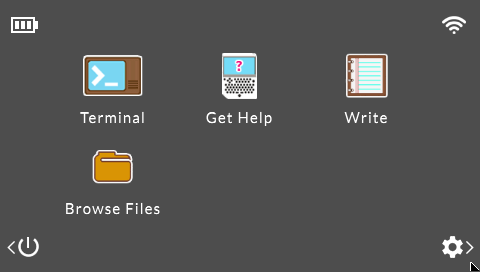
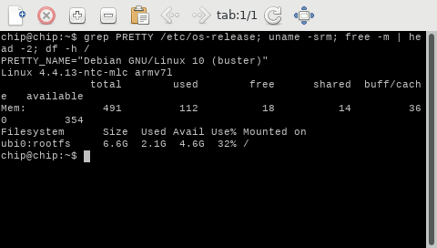
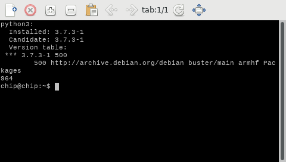
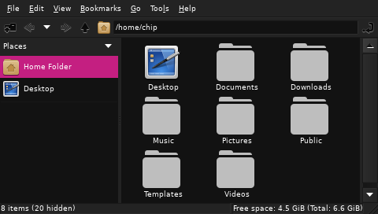

<div align="center">

# PocketCHIP Debian

**Debian 10 on the PocketCHIP: a flashable image with a working `apt`, SSH on the first boot, and the tools to rebuild it.**

[](LICENSE)
[](https://github.com/ddtdanilo/pocketchip-debian/releases/latest)


[](https://buymeacoffee.com/ddtdanilo)



</div>

## Why this project exists

The PocketCHIP is a wonderful little pocket Linux computer, and it is stuck.
Next Thing Co. went out of business in 2018 and took its servers with it. The
stock image runs Debian 8 ("jessie"), whose package archives have moved, NTC's
own package repository is gone, and the official flashing tool downloads from a
server that no longer exists. Out of the box you have a device that boots, but
cannot install software and cannot be re-flashed with the tools it came with.

This project brings it back:

- a **flashable Debian 10 image** that boots straight into the PocketCHIP
  launcher, where `apt` works and SSH is on;
- a **flasher** for macOS and Linux that works with today's `fastboot`;
- the **scripts and notes to rebuild everything**, so the image is not a black
  box and you can adapt it.

It was built on a real device, step by step, and every claim in the docs says
whether it was verified on hardware.

> [!IMPORTANT]
> **v0.1.0 is a pre-release.** The system in the image was verified on the
> device it was exported from, but the image has **not yet been flashed back
> and booted**, and `scripts/flash.sh` has not been run end to end. If you try
> it, please report the result in an issue, good or bad. The FEL recovery mode
> means a failed flash can always be redone.

## What you get

| | |
|---|---|
| **System** | Debian 10.13 "buster", 961 packages, kernel 4.4.13 (NTC's, unchanged) |
| **Screen** | The original PocketCHIP launcher on the 480x272 panel |
| **Packages** | `apt` works (Debian's archive), signatures verified |
| **Access** | SSH on from the first boot, `chip.local` via mDNS, SFTP |
| **Optional** | FTP and VNC installed but off; one command to turn them on |
| **GPU** | OpenGL ES 2.0 on the Mali-400 with one script ([docs/gpu.md](docs/gpu.md)) |
| **USB** | Serial console and Ethernet over the micro-USB cable, no Wi-Fi needed |
| **Wi-Fi** | Connects and reconnects on its own |
| **Rebuildable** | Export, image build and flashing are scripted and documented |

## Screenshots

Taken over VNC from the device the image was exported from, running the
image's launcher configuration.

<table>
  <tr>
    <td align="center"><br><sub>Launcher</sub></td>
    <td align="center"><br><sub>Terminal: Debian 10 on kernel 4.4.13</sub></td>
  </tr>
  <tr>
    <td align="center"><br><sub><code>apt</code> working</sub></td>
    <td align="center"><br><sub>File browser</sub></td>
  </tr>
</table>

## Quick start

You need a PocketCHIP, a micro-USB **data** cable and a Mac or Linux computer.
Flashing **erases** the device's internal storage.

1. Download the image for your NAND, `SHA256SUMS-v0.1.0` and
   `pocketchip-bootloader-ntc-b126.tar.gz` from the
   [latest release](https://github.com/ddtdanilo/pocketchip-debian/releases/latest).
   Not sure which NAND you have? Take the Hynix image; the flasher checks and
   stops before erasing if it is the wrong one.
2. Install the host tools (`sunxi-fel`, `fastboot`, `mkimage`) and put the
   device in FEL mode (bridge the FEL and GND pins, then plug it in). Step by
   step in [docs/flashing.md](docs/flashing.md).
3. Flash:

   ```sh
   mkdir bootloader && tar -xzf pocketchip-bootloader-ntc-b126.tar.gz -C bootloader
   scripts/flash.sh --ubi pocketchip-debian10-v0.1.0-hynix-8g.ubi.sparse \
                    --bootloader-dir bootloader
   ```

4. Remove the jumper, power on, wait a couple of minutes, and log in:

   ```sh
   ssh chip@chip.local        # password: chip  - change it right away with `passwd`
   ```

Then read [docs/first-boot.md](docs/first-boot.md).

## Documentation

| Guide | What it covers |
|---|---|
| [Flashing](docs/flashing.md) | Host tools, FEL mode, flashing, troubleshooting |
| [First boot](docs/first-boot.md) | Accounts, Wi-Fi, SSH/FTP/VNC, `apt` |
| [Networking](docs/networking.md) | Wi-Fi limits, USB Ethernet, serial console, measured speeds |
| [GPU acceleration](docs/gpu.md) | Turn on OpenGL ES 2.0 on the Mali-400 |
| [Building the image](docs/building.md) | Export a device, build the UBI image in Docker |
| [Upgrading the stock image](docs/upgrade-from-stock.md) | How Debian 8 was taken to Debian 10 |
| [Hardware notes](docs/hardware.md) | What was verified on the device and what was not |
| [Known issues](docs/known-issues.md) | The honest list |
| [Package list](docs/packages.txt) | Everything in the image, with versions |

## What works and what does not

Verified on the PocketCHIP (Hynix 8 GB NAND) the image was exported from: boot,
launcher on the screen, Wi-Fi, SSH, `apt`, USB serial and Ethernet, battery
readings. Not yet verified on a device flashed with the release image: the
first-boot steps (SSH key generation, USB Ethernet coming up by itself) and the
flasher itself.

Optional: **GPU acceleration** (OpenGL ES 2.0). ARM's Mali library is
proprietary, so it is not in the image; `scripts/enable-gpu.sh` downloads it
from NTC's repository and sets up X for it. Verified on the device, see
[docs/gpu.md](docs/gpu.md).

Not available: **PICO-8** and **SunVox** (proprietary; see
[THIRD_PARTY.md](THIRD_PARTY.md)).

Not verified: the **Toshiba 4 GB** image (built the same way, no device to test
it), Bluetooth, the touch panel and a physical microphone. See
[docs/hardware.md](docs/hardware.md).

## How it is made

```
stock NTC image -> upgrade to Debian 10 -> export-rootfs.sh -> build-image.sh -> flash.sh
 (Debian 8)        (docs/upgrade-from-      sanitized copy      Docker + NTC's     FEL + fastboot
                    stock.md)               of the system       mtd-utils          to the device
```

The exporter removes personal data and proprietary packages and refuses to
finish if anything private is left. The image is built with NTC's fork of
`mtd-utils`, because the CHIP's MLC NAND needs a layout (`ubinize -M dist3`)
that upstream tools cannot write. Details in [docs/building.md](docs/building.md).

## FAQ

**Is it safe to leave on the internet?** No. Debian 10 and Linux 4.4 no longer
get security updates. Keep it on a trusted LAN and change the default password.
See [SECURITY.md](SECURITY.md).

**Can I brick the device by flashing?** The FEL recovery mode lives in the SoC's
boot ROM, not in the NAND, so a bad flash can be redone from FEL mode.

**Why Debian 10 and not something newer?** It is the newest release I took the
device to and validated. The kernel is NTC's 4.4, which is what drives the
screen and the Wi-Fi chip; newer releases were not attempted.

**Does it have GPU acceleration?** OpenGL ES 2.0, yes, after one script:
`sudo scripts/enable-gpu.sh --accept-arm-eula`. Desktop OpenGL, no: the
Mali-400 only does OpenGL ES. Details and numbers in [docs/gpu.md](docs/gpu.md).

**Can I get PICO-8 back?** Not with NTC's package: it depends on `libcurl3`,
which Debian 10 does not have. If you own PICO-8, try the current Raspberry Pi
build from Lexaloffle (untested here).

**Will it work on a bare C.H.I.P. (no PocketCHIP case)?** The flasher supports
both, and the launcher is made for the PocketCHIP's screen and keyboard.
Untested on a bare C.H.I.P.

## Contributing

Issues and pull requests are welcome, especially hardware test results. Start
with [CONTRIBUTING.md](CONTRIBUTING.md). AI coding agents: read
[AGENTS.md](AGENTS.md).

## Support

This is a free hobby project, made in spare time. If it brought a dusty
PocketCHIP back to life for you, you can say thanks with a coffee:

<a href="https://buymeacoffee.com/ddtdanilo"></a>

Starring the repo and reporting what worked on your hardware helps just as much.

## License

The scripts, configuration and documentation in this repository are
[MIT](LICENSE) licensed. The system image bundles software under many other
licenses; see [THIRD_PARTY.md](THIRD_PARTY.md).

## Acknowledgements

- **Next Thing Co.**, for the C.H.I.P. and PocketCHIP, and for publishing their
  software as open source.
- The **Internet Archive**'s [C.H.I.P. Flash Collection](https://archive.org/details/C.h.i.p.FlashCollection),
  which preserved NTC's images and tools.
- **Thore Krug**'s [Flash-CHIP](https://github.com/Thore-Krug/Flash-CHIP) and the
  [Project-chip-crumbs](https://github.com/Project-chip-crumbs) community, whose
  work on the flashing process this builds on.
- **luzhuomi**'s
  [guide to upgrading the PocketCHIP to Debian Buster](https://gist.github.com/luzhuomi/526fbcc30f3522f09eacf20d0f776fa5),
  which showed the upgrade path was possible and which display driver to use.
- [ntc-chip-revived](https://github.com/ntc-chip-revived) for keeping NTC's
  `mtd-utils` fork alive, and the [linux-sunxi](https://linux-sunxi.org/) project
  for `sunxi-tools`.
