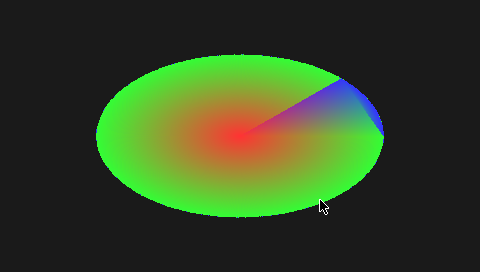

# GPU acceleration (Mali-400)

The PocketCHIP's Mali-400 GPU does OpenGL ES 1.1 and 2.0. The image ships
without acceleration because ARM's userspace library is proprietary, but one
script turns it on. It was verified on a PocketCHIP with this release's Debian 10.

<p align="center"></p>

| | Without (default) | With `enable-gpu.sh` |
|---|---|---|
| X driver | `fbdev` | `armsoc` with DRI2 |
| EGL / OpenGL ES 2.0 | not available | ARM Mali r6p0, `GL_RENDERER: Mali-400 MP` |
| `tools/gles2-bench` (500 triangles, 480x272) | cannot run | about 72 to 83 fps |

What is **not** accelerated: desktop OpenGL (`glxgears`, most Linux games built
for desktop GL). The Mali only speaks OpenGL ES, so X still reports a software
GLX provider. `armsoc` runs EXA in software mode (`Soft EXA mode` in the X log),
so ordinary 2D drawing is not accelerated either. The gain is for
programs written for EGL + OpenGL ES 2 (SDL2 with the GLES2 renderer, Qt with
EGL, emulators with a GLES backend, your own code).

## Enable it

On the device, from a clone of this repository (or copy just the script):

```sh
sudo scripts/enable-gpu.sh --accept-arm-eula
sudo systemctl restart lightdm
```

Read [ARM's licence](https://github.com/NextThingCo/chip-mali-userspace/blob/a9d2b5060103baa3f5d6e98011e28f2d4fae2fa6/debian/copyright)
first: the flag means you accept it. The script needs a network connection and
spends most of its time in `apt` and the compiler. It:

1. installs the build tools, builds NTC's
   [`xf86-video-armsoc`](https://github.com/nextthingco/xf86-video-armsoc) (MIT)
   at a pinned commit against Debian 10's X server, installs the driver, and
   removes the build tools it added;
2. downloads `libMali.so` from NTC's own
   [`chip-mali-userspace`](https://github.com/NextThingCo/chip-mali-userspace)
   repository at a pinned commit and installs it as the `chip-mali-userspace`
   package, with the same links NTC used (`libEGL`, `libGLESv1_CM`, `libGLESv2`);
3. switches the `Device` section of `/etc/X11/xorg.conf` from `fbdev` to
   `armsoc` with `Option "DRI2" "true"`, keeping a copy as
   `/etc/X11/xorg.conf.fbdev`.

The Mali kernel module (`chip-mali-modules`, GPL) is already in the image and
loads at boot. Users need to be in the `video` group to open `/dev/mali`; the
default `chip` user is.

## Check it

```sh
grep "DRI2] Setup complete" /var/log/Xorg.0.log
gcc -O2 -o gles2-bench tools/gles2-bench.c -lEGL -lGLESv2 -lX11 -lm
DISPLAY=:0 ./gles2-bench 10 500
```

Expected output starts with `GL_RENDERER: Mali-400 MP` and `GL_VERSION:
OpenGL ES 2.0`. Compiling needs `build-essential`, `libx11-dev` and
`mesa-common-dev` (for `KHR/khrplatform.h`).

The `(EE) AIGLX error: dlopen of .../armsoc_dri.so failed` line in the X log is
expected: there is no desktop-GL DRI driver for the Mali, and X falls back to
software GLX.

## Turn it off

```sh
sudo scripts/enable-gpu.sh --revert
sudo systemctl restart lightdm
```

This restores the `fbdev` configuration and removes the X driver. The Mali
library stays; remove it with `sudo apt-get purge chip-mali-userspace`.

## Why it works this way

The stock NTC image had acceleration through exactly these two pieces: the
`armsoc` X driver with DRI2, and an X11 build of `libMali.so` that talks to it.
Community guides for upgrading to Debian 10 switch X to `fbdev` because the
`armsoc` package is gone, and acceleration goes with it. NTC's `armsoc` fork
still compiles unchanged against Debian 10's X server 1.20, so the original
stack can come back.

The open-source alternative, the `lima` driver in Mesa, needs a mainline kernel
(5.2 or later). This image keeps NTC's 4.4 kernel, which drives the screen,
Wi-Fi and NAND.

### Notes

- `libMali.so` and Mesa's `mesa-common-dev` both ship `KHR/khrplatform.h`.
  The script handles that conflict; if you install NTC's original package by
  hand, use `dpkg -i --force-overwrite` for the header.
- The Mali package replaces `libegl1` and `libgles2`. Do not install those
  afterwards; `apt` will try to remove the Mali library.
- `armsoc` also enables the composite (TV-out) connector. The 480x272 panel stays
  the primary output.
